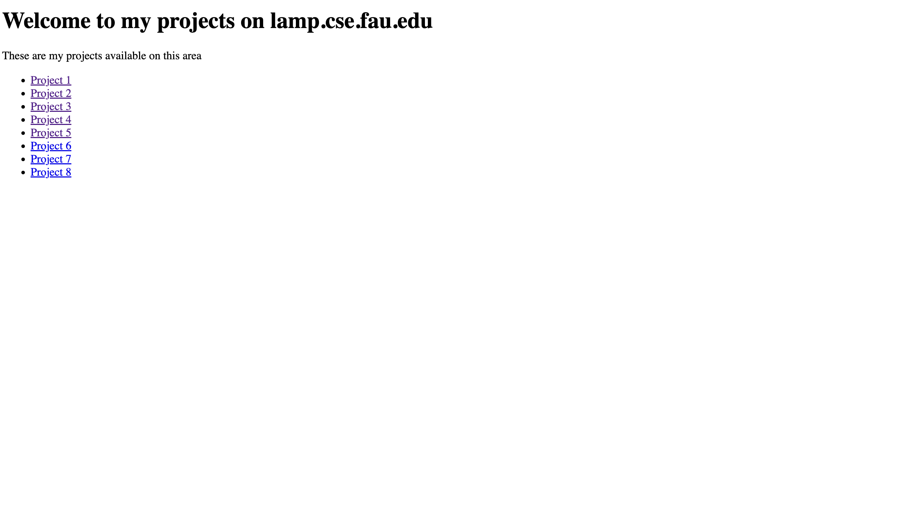
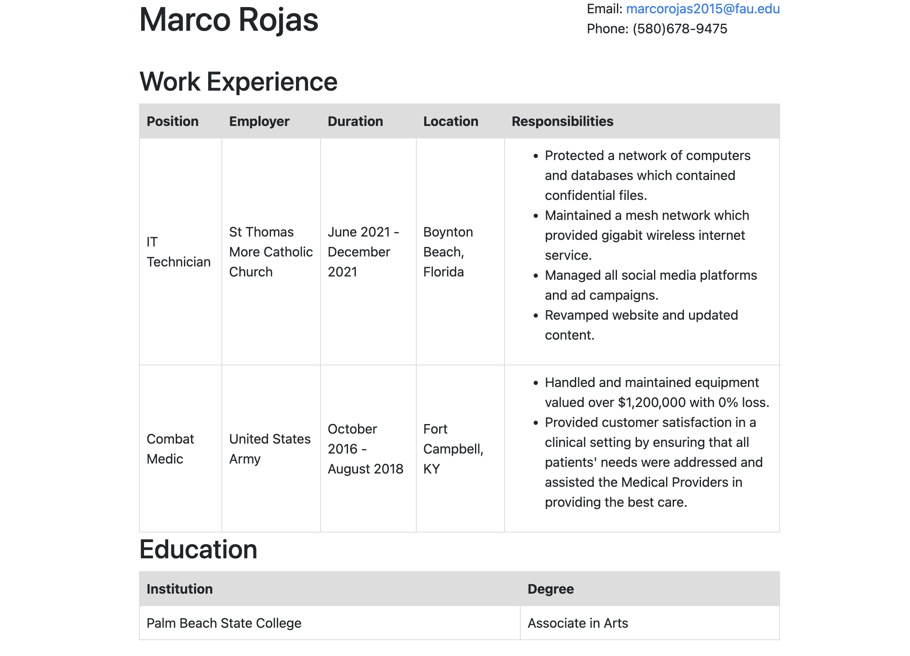
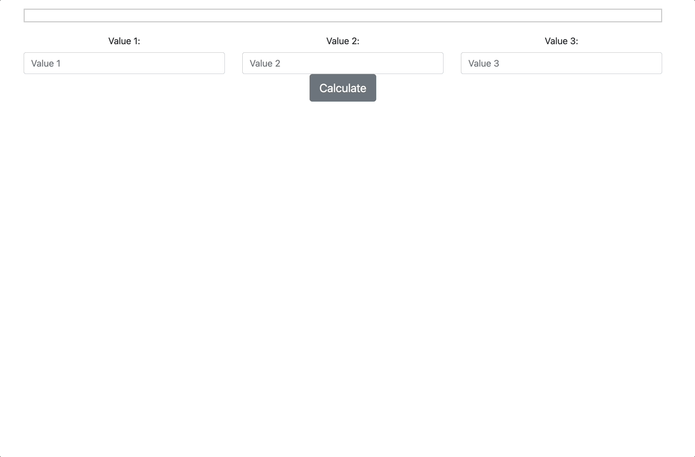
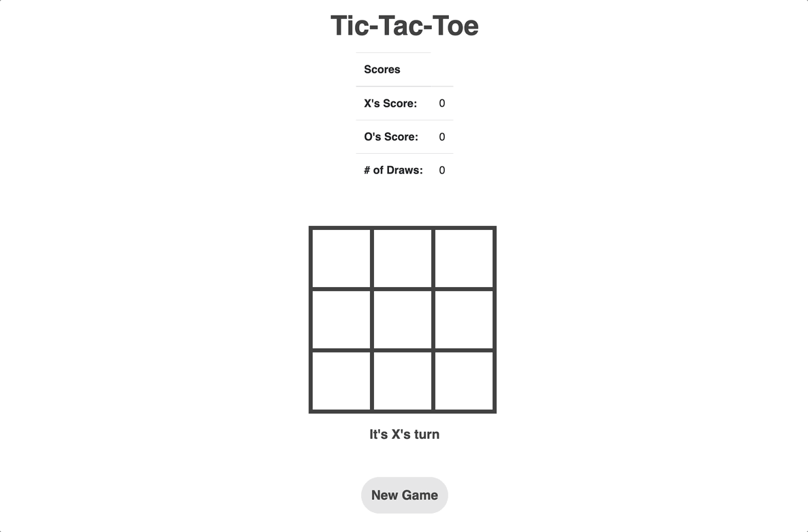

# Marco Rojas - Z23354683

# Projects Overview
This repository showcases a collection of projects I completed while studying Internet Computing - COP3183 at FAU as part of my Bachelor of Computer Science degree.

At the start of the semester, we were provided with an index.html file as a template to commence our web development journey by learning the fundamentals. This file served as the foundation for our subsequent projects, which enabled us to build on the skills and knowledge gained through our coursework. Below is a screenshot for reference.

## Project 1: Basic Resume using HTML & CSS
This project involved creating a basic resume using HTML and CSS, laying the foundation for mastering web development fundamentals.

## Project 2: Personal Website using Bootstrap
In this project, I leveraged a Bootstrap template to craft an aesthetically pleasing personal website, which taught me how to utilize Bootstrap's powerful components.

## Project 3: Basic Javascript Calculation
With this project, I gained proficiency in using Javascript to manipulate data and display basic calculations on web pages.

## Project 4: Tic-Tac-Toe game with advanced features
Building on a Tic-Tac-Toe application, I implemented advanced features such as a status board to track player moves and games won between players. Additionally, I incorporated the ability to play against a computer opponent.

## Project 5: Navigation Bar Implementation
For this project, I revamped the original index.html file provided at the start of the semester and added a navigation bar to all other projects. This enabled users to easily navigate between the different projects showcased in this repository, providing a more seamless user experience. The navigation bar was implemented using HTML and CSS, with appropriate links to each project. Through this project, I gained experience in implementing navigation bars and improving the overall user experience of web pages.